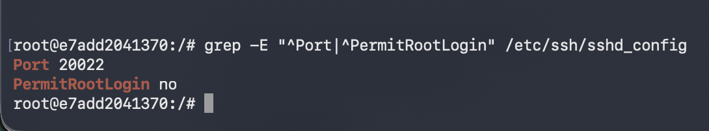
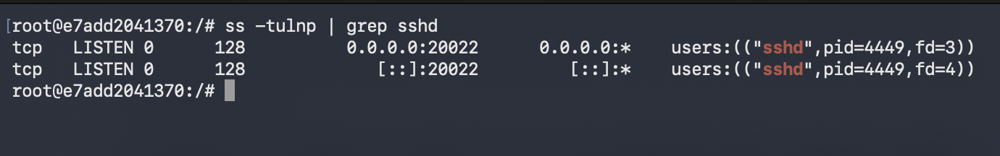
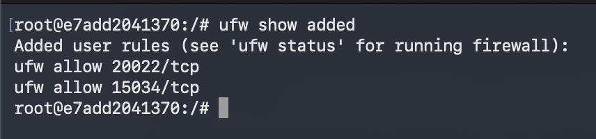
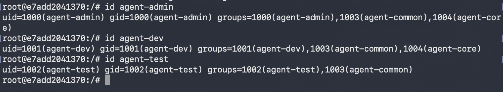
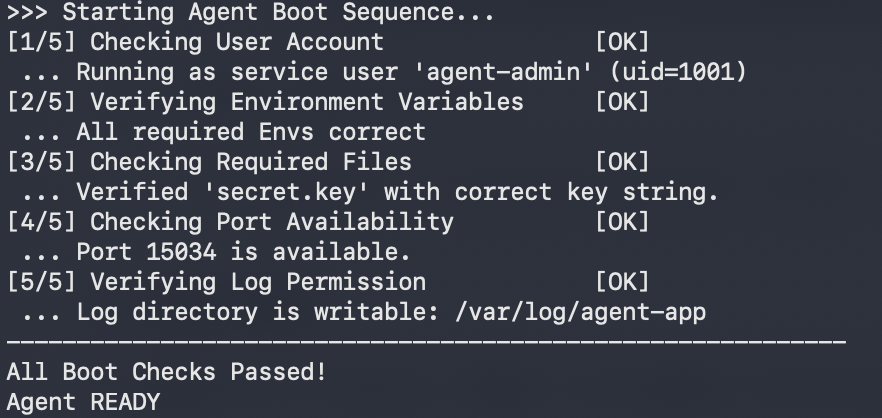
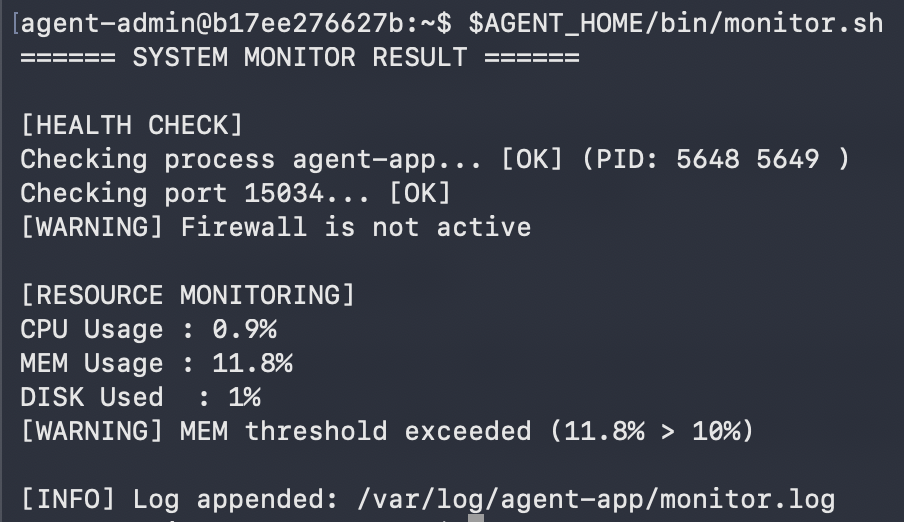
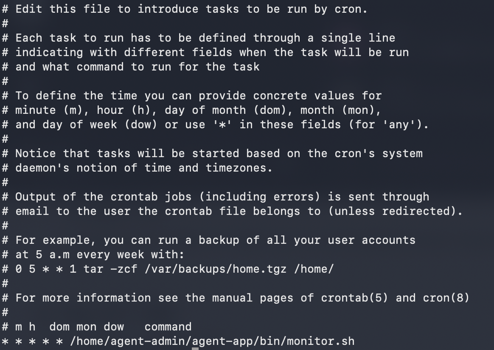
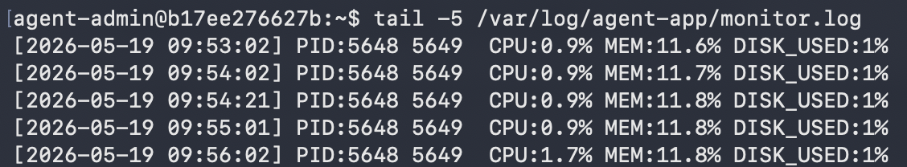
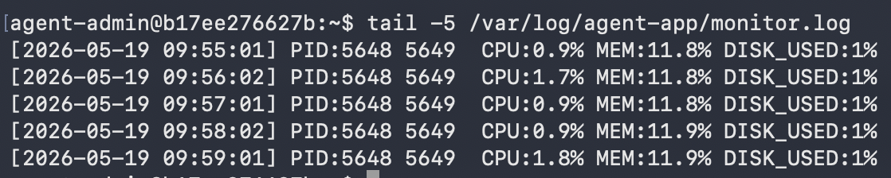

# 시스템 관제 자동화 스크립트 개발 - 수행 내역서

## 개발 환경
- OS: Ubuntu 24.04 LTS (Docker 컨테이너, --platform linux/amd64)
- 컨테이너명: agent-server

---

## 1. 기본 보안 및 네트워크 설정

### 1-1. SSH 설정

```bash
vim /etc/ssh/sshd_config
# Port 20022
# PermitRootLogin no
service ssh start
```




### 1-2. 방화벽 설정 (UFW)

```bash
ufw allow 20022/tcp
ufw allow 15034/tcp
ufw show added
```



> ⚠️ Docker 컨테이너 환경 특성상 커널 권한 제한으로 `ufw enable` 불가.
> 포트 규칙(20022/tcp, 15034/tcp)은 정상 등록 완료.
> 실제 Ubuntu 서버 환경에서는 정상 동작함.

---

## 2. 계정/그룹 생성

```bash
# 계정 생성
useradd -m -s /bin/bash agent-admin
useradd -m -s /bin/bash agent-dev
useradd -m -s /bin/bash agent-test

# 그룹 생성
groupadd agent-common
groupadd agent-core

# 그룹 배정
usermod -aG agent-common agent-admin
usermod -aG agent-common agent-dev
usermod -aG agent-common agent-test
usermod -aG agent-core agent-admin
usermod -aG agent-core agent-dev

# agent-admin 기본그룹 변경 (로그 파일 그룹 자동 설정)
usermod -g agent-core agent-admin
```



---

## 3. 디렉토리 구조 및 권한 설정

```bash
# 디렉토리 생성
mkdir -p /home/agent-admin/agent-app/upload_files
mkdir -p /home/agent-admin/agent-app/api_keys
mkdir -p /home/agent-admin/agent-app/bin
mkdir -p /var/log/agent-app

# AGENT_HOME 권한
chown agent-admin:agent-core /home/agent-admin/agent-app
chmod 755 /home/agent-admin/agent-app

# upload_files: agent-common R/W
chown agent-admin:agent-common /home/agent-admin/agent-app/upload_files
chmod 770 /home/agent-admin/agent-app/upload_files

# api_keys: agent-core ONLY
chown agent-admin:agent-core /home/agent-admin/agent-app/api_keys
chmod 770 /home/agent-admin/agent-app/api_keys
setfacl -m g:agent-common:--- /home/agent-admin/agent-app/api_keys

# bin: agent-dev 작성, agent-core 실행
chown agent-dev:agent-core /home/agent-admin/agent-app/bin
chmod 750 /home/agent-admin/agent-app/bin

# /var/log/agent-app: agent-core ONLY + setgid
chown agent-admin:agent-core /var/log/agent-app
chmod 770 /var/log/agent-app
chmod g+s /var/log/agent-app
setfacl -m g:agent-common:--- /var/log/agent-app

# archive 디렉토리 생성
mkdir -p /var/log/agent-app/archive
```


> ℹ️ setgid 설정으로 디렉토리 안에서 생성되는 파일이 누가 만들든 항상 agent-core 그룹 상속.

---

## 4. 환경변수 설정 및 키파일 생성

```bash
# agent-admin ~/.bashrc에 추가
export AGENT_HOME=/home/agent-admin/agent-app
export AGENT_PORT=15034
export AGENT_UPLOAD_DIR=$AGENT_HOME/upload_files
export AGENT_KEY_PATH=$AGENT_HOME/api_keys/t_secret.key
export AGENT_LOG_DIR=/var/log/agent-app
umask 0117

# 키파일 생성
echo "agent_api_key_test" > /home/agent-admin/agent-app/api_keys/t_secret.key
```


---

## 5. 앱 실행

```bash
# 맥에서 컨테이너로 파일 복사
docker cp ~/Downloads/agent-app agent-server:/home/agent-admin/agent-app/

# 권한 설정
chown agent-admin:agent-core /home/agent-admin/agent-app/agent-app
chmod 750 /home/agent-admin/agent-app/agent-app

# agent-admin으로 실행
su - agent-admin
$AGENT_HOME/agent-app
```



---

## 6. monitor.sh

### 파일 위치 및 권한

| 항목 | 값 |
|------|-----|
| 경로 | $AGENT_HOME/bin/monitor.sh |
| 소유자 | agent-dev |
| 그룹 | agent-core |
| 권한 | 750 (rwxr-x---) |



### 소스코드

```bash
#!/bin/bash
umask 0117

AGENT_HOME=/home/agent-admin/agent-app
AGENT_LOG_DIR=/var/log/agent-app
LOG_FILE=$AGENT_LOG_DIR/monitor.log
APP_NAME=agent-app
PORT=15034
MAX_SIZE=$((10 * 1024 * 1024))
MAX_FILES=10

echo "====== SYSTEM MONITOR RESULT ======"
echo ""
echo "[HEALTH CHECK]"

PID=$(pgrep -f "$AGENT_HOME/$APP_NAME" | tr '\n' ' ')
if [ -z "$PID" ]; then
    echo "Checking process $APP_NAME... [FAIL] Not running"
    exit 1
fi
echo "Checking process $APP_NAME... [OK] (PID: $PID)"

PORT_CHECK=$(ss -tulnp | grep ":$PORT ")
if [ -z "$PORT_CHECK" ]; then
    echo "Checking port $PORT... [FAIL] Not listening"
    exit 1
fi
echo "Checking port $PORT... [OK]"

UFW_STATUS=$(systemctl is-active ufw 2>/dev/null)
if [ "$UFW_STATUS" != "active" ]; then
    echo "[WARNING] Firewall is not active"
fi

echo ""
echo "[RESOURCE MONITORING]"

CPU=$(top -bn1 | grep "Cpu(s)" | awk '{print $2+$4}')
MEM=$(free | grep Mem | awk '{printf "%.1f", $3/$2*100}')
DISK=$(df / | tail -1 | awk '{print $5}' | tr -d '%')

echo "CPU Usage : $CPU%"
echo "MEM Usage : $MEM%"
echo "DISK Used  : $DISK%"

CPU_INT=$(echo $CPU | cut -d'.' -f1)
MEM_INT=$(echo $MEM | cut -d'.' -f1)

if [ "$CPU_INT" -gt 20 ]; then
    echo "[WARNING] CPU threshold exceeded ($CPU% > 20%)"
fi
if [ "$MEM_INT" -gt 10 ]; then
    echo "[WARNING] MEM threshold exceeded ($MEM% > 10%)"
fi
if [ "$DISK" -gt 80 ]; then
    echo "[WARNING] DISK threshold exceeded ($DISK% > 80%)"
fi

TIMESTAMP=$(date '+%Y-%m-%d %H:%M:%S')
echo "[$TIMESTAMP] PID:$PID CPU:$CPU% MEM:$MEM% DISK_USED:$DISK%" >> $LOG_FILE
echo ""
echo "[INFO] Log appended: $LOG_FILE"

if [ -f "$LOG_FILE" ]; then
    FILE_SIZE=$(stat -c%s "$LOG_FILE")
    if [ "$FILE_SIZE" -gt "$MAX_SIZE" ]; then
        if [ -f "$LOG_FILE.$MAX_FILES" ]; then
            rm "$LOG_FILE.$MAX_FILES"
        fi
        for i in $(seq $((MAX_FILES-1)) -1 1); do
            if [ -f "$LOG_FILE.$i" ]; then
                mv "$LOG_FILE.$i" "$LOG_FILE.$((i+1))"
            fi
        done
        mv "$LOG_FILE" "$LOG_FILE.1"
    fi
fi
```

---

## 7. cron 등록

```bash
# agent-admin crontab
* * * * * /home/agent-admin/agent-app/bin/monitor.sh
0 0 * * * /home/agent-admin/agent-app/bin/archive.sh
```





---

## 8. 보너스 1 - report.sh

monitor.log를 분석해 CPU/MEM/DISK의 평균/최대/최소와 샘플 수를 출력.
시작/종료 시간 입력받아 해당 구간만 분석 가능.

| 항목 | 값 |
|------|-----|
| 경로 | $AGENT_HOME/bin/report.sh |
| 소유자 | agent-dev |
| 그룹 | agent-core |
| 권한 | 750 |

---

## 9. 보너스 2 - archive.sh

시간 기반 로그 보존 정책 구현.

| 항목 | 값 |
|------|-----|
| 경로 | $AGENT_HOME/bin/archive.sh |
| 소유자 | agent-dev |
| 그룹 | agent-core |
| 권한 | 750 |

> ⚠️ 원문의 아카이브 경로 `/var/log/monitor/agent-app/archive/` 는 오타로 판단,
> `/var/log/agent-app/archive/` 로 변경하여 구현.

---

## 필수 증거 자료 체크리스트

| 항목 | 캡처 |
|------|------|
| SSH 포트 변경(20022) 및 Root 원격 접속 차단 | ✅ |
| 방화벽 UFW 규칙 등록 (20022/tcp, 15034/tcp) | ✅ |
| 계정/그룹 생성 확인 | ✅ |
| 디렉토리 구조 및 권한(ACL 포함) 확인 | ✅ |
| 앱 Boot Sequence 5단계 [OK] 및 "Agent READY" | ✅ |
| monitor.sh 실행 결과 | ✅ |
| monitor.log 누적 기록 최근 라인 | ✅ |
| crontab 매분 실행 등록 및 자동 실행 확인 | ✅ |
